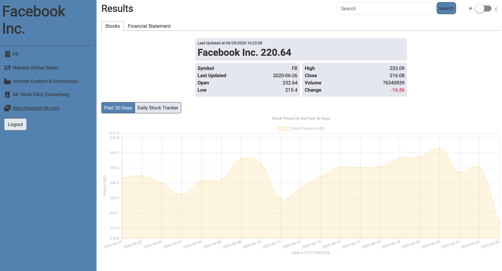

# The Scouting Report

_The Scouting Report_ offers a quick lookup of the live stock prices and past financial performance of US publicly-traded companies.

The stock data is presented in a line graph or in tabular form while the financial statement data can be viewed in a line graph, bar graph, radar graph, or in tabular form.

Application built using React, TypeScript, Chart.js, Socket.io, Node, Express, Firebase, and Redux.

## Live Link

[View The Scouting Report Live](https://scouting-report.herokuapp.com/).

## Features:

#### 1. Login and get authenticated with either Google, Facebook, or GitHub

#### 2. Look up a publically-traded US company

#### 3. View live stock prices that change in real time

#### 4. Then compare and analyze its financial performance in recent years

#### 5. Toggle between light and dark mode

